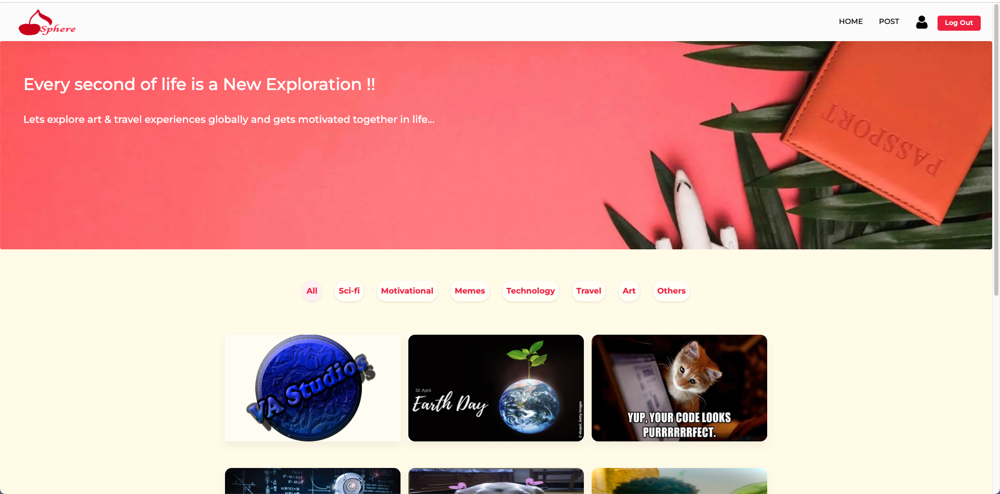
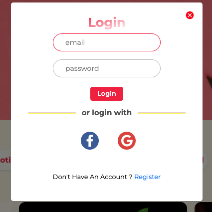
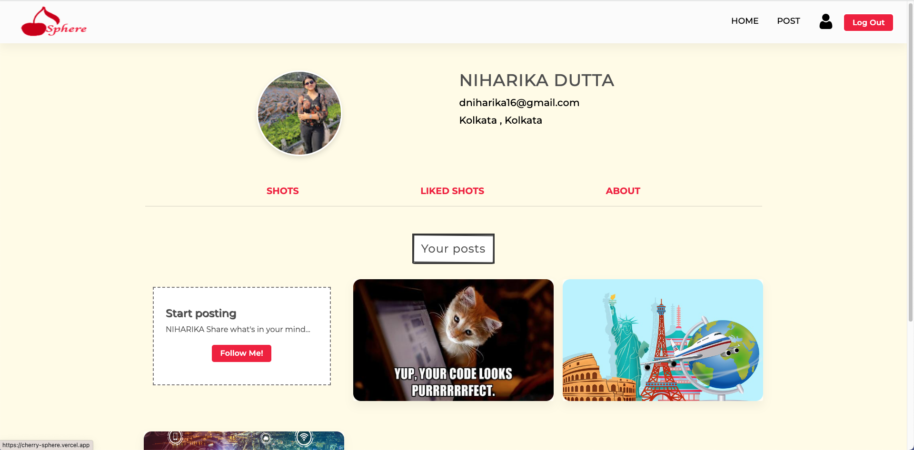
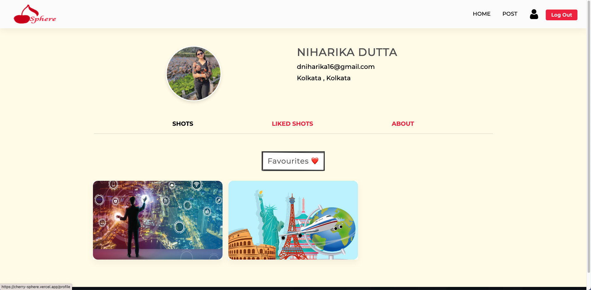
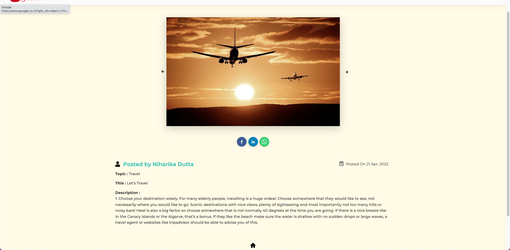
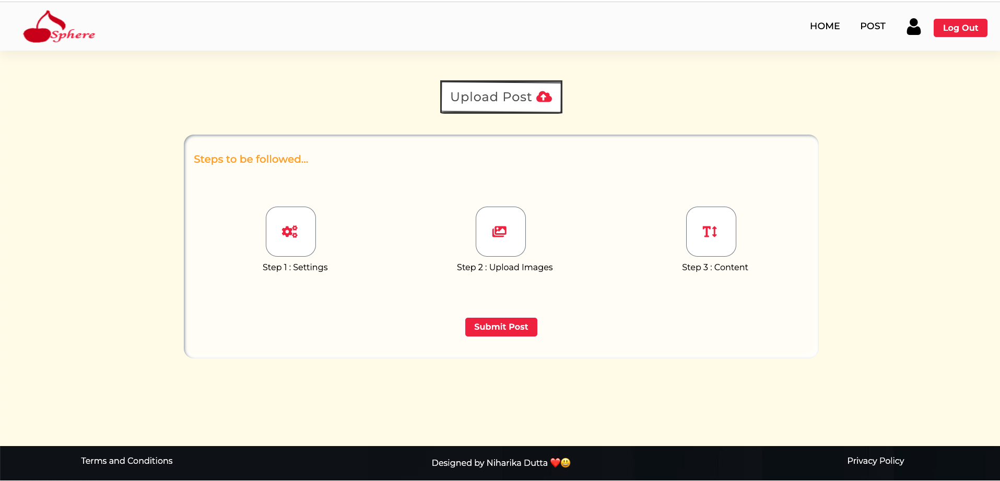
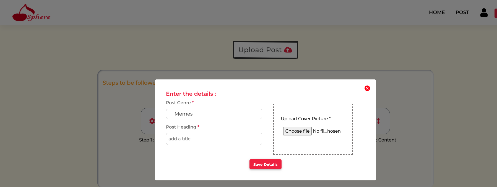
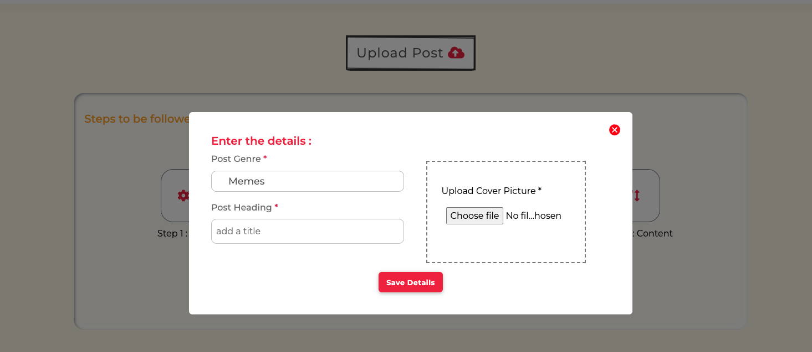

<h1 align="center">Cherry Sphere 🍒 </h1>
  

  <a href="https://cherry-sphere.vercel.app/"> <b> Live Site </b></a>    
  

<!-- TABLE OF CONTENTS -->

  
Table of Contents

  <ol>
    <li><a href="#about-the-project">About The Project</a></li>
    <li><a href="#dev-dependencies">Dev Dependencies</a></li>
    <li><a href="#contact">Contact</a></li>  </ol>

<!-- ABOUT THE PROJECT -->

## About The Project

Website that enables the user to `create, post and share there blogs/content`✏️ once they are registered. Supports `email`, `google` and `facebook` authentication:octocat: using Firebase. User can like others posts and visualise publisher's profile.
 

  

    

- ### User Profile

    
    

- ### Single Post

    

- ### Upload Post
    
    
    
   

## Dev Dependencies

- [React](https://reactjs.org/)
- [Firebase](https://firebase.google.com/docs)
- [Material UI](https://mui.com/)

<!-- CONTACT -->

## Contact

Project Link: [https://github.com/niharika2k00/Cherry-Sphere](https://github.com/niharika2k00/Cherry-Sphere) 
LinkedIn - [Niharika Dutta](https://www.linkedin.com/in/niharika-dutta-ab40a11a6/) 
Twitter - [@niharika_2k](https://twitter.com/niharika_2k) 
